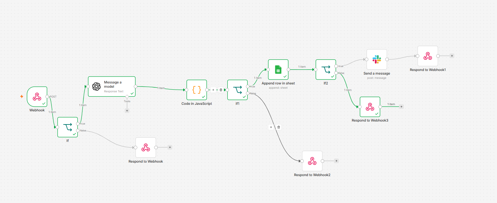
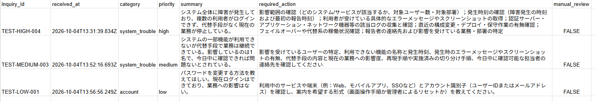
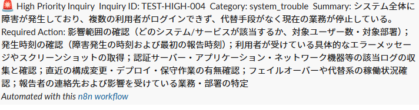
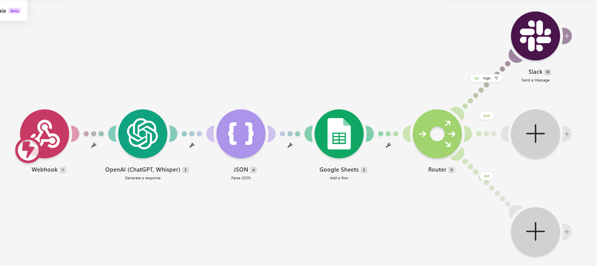
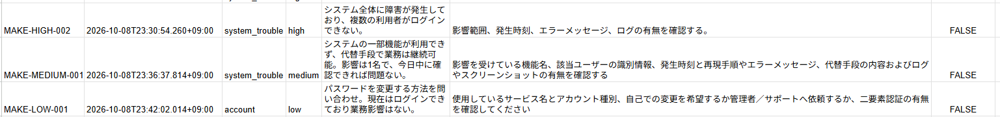
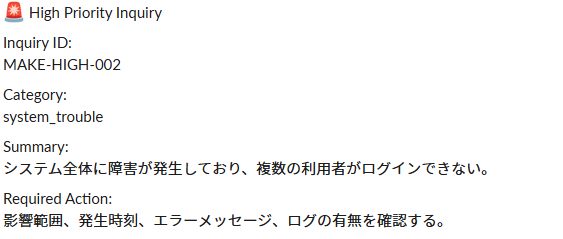

# AI Workflow Automation

n8n / Make / OpenAI API を使い、問い合わせ内容をAIで分類・要約し、優先度に応じて記録・通知する業務自動化PoCです。

以下のWorkflowからn8n Workflowまではn8n版の説明です。Make版は「Make Version」で紹介します。

## Workflow

```text
Webhook
→ Input Validation
→ OpenAI
→ JSON Parse / Validation
→ Manual Review Routing
→ Google Sheets
→ Priority Check
→ Slack Notification
```

必須入力（`inquiry_id` と `message`）を確認し、OpenAIで問い合わせを分類・要約します。AI出力をJSONとして解析・検証した後、結果をGoogle Sheetsに保存します。`high` の場合だけSlackへ通知し、`medium` と `low` は通知しません。入力不正、AI出力不正はそれぞれ専用のWebhookレスポンスを返します。

## Implemented Features

- Webhookによる問い合わせ受付
- `inquiry_id` と `message` の必須入力チェック
- OpenAIによるカテゴリ分類・優先度判定・要約
- AI出力のJSONパース
- `category` / `priority` の許可値検証
- 不正なAI出力を `manual_review` に分岐
- Google Sheetsへの分析結果保存
- `high` priority のみSlack通知
- 正常系 / 入力不正 / AI出力不正の分岐とWebhookレスポンス

## Screenshots

### Workflow Overview

n8nで構築した問い合わせ一次整理ワークフローです。



### Google Sheets Result

AIによる分類・要約結果をGoogle Sheetsへ保存します。
high / medium / low の3パターンを確認しています。



### Slack Notification

`priority = high` の問い合わせのみSlackへ通知します。



## Safety Design

- AI出力をそのまま後続処理へ渡さず、JSONとして解析可能か確認
- `category` / `priority` が許可値に含まれるか検証
- `summary` / `required_action` の必須項目を確認
- 不正なAI出力は `manual_review` に分岐
- 認証情報はn8n Credentialsで管理し、GitHubへ含めない

## Test Cases

### High Priority

- 複数ユーザーに影響
- 代替手段なし
- 業務停止
- Google Sheetsへ保存
- Slack通知あり
- `notification_sent = true`

### Medium Priority

- 一部機能に問題
- 代替手段あり
- 業務継続可能
- Google Sheetsへ保存
- Slack通知なし
- `notification_sent = false`

## Tech Stack

- n8n
- OpenAI API
- Docker
- Google Sheets
- Slack

## Setup

1. n8nを起動します（Docker Composeを利用できます）。
2. n8nにOpenAI、Google Sheets、SlackのCredentialsを登録します。
3. `n8n/inquiry-triage-workflow.public.json` をインポートします。
4. Google SheetsのファイルとSlackチャンネルを自分の環境に合わせて設定し、Webhookを有効化します。

## n8n Workflow

`n8n/inquiry-triage-workflow.public.json` is a sanitized workflow export for public use.

Before importing, configure your own credentials and resource IDs for:

- OpenAI
- Google Sheets
- Slack

## Make Version

Makeを使って、同じ問い合わせ一次整理フローをローコードで再実装しています。

### Workflow

```text
Webhook
→ OpenAI
→ Parse JSON
→ Google Sheets
→ Router
   └ Filter: priority = high
        → Slack
```

### Implemented Features

- Webhookによる問い合わせ受付
- OpenAIによるカテゴリ分類・優先度判定・要約
- Parse JSONによるAI出力の構造化
- Google Sheetsへの分析結果保存
- Router + Filterによるpriority判定
- `high` priority のみSlack通知
- high / medium / low の3パターンを動作確認

### Verified Behavior

| priority | Google Sheets保存 | Slack通知 |
| --- | --- | --- |
| high | あり | あり |
| medium | あり | なし |
| low | あり | なし |

### Tech Stack

- Make
- OpenAI API
- Google Sheets
- Slack

### Screenshots

#### Workflow Overview

Makeで構築した問い合わせ一次整理フローです。



#### Google Sheets Result

high / medium / low の3パターンをGoogle Sheetsへ保存しています。



#### Slack Notification

`priority = high` の問い合わせのみSlackへ通知します。



## n8n vs Make

両版とも、問い合わせの分類・優先度判定・要約、Google Sheetsへの保存、high priorityのみのSlack通知を実装しています。

- n8n版: 入力チェック、JSONの解析・必須項目・許可値の検証、`manual_review` 分岐など、安全性と処理の制御を重視しています。
- Make版: GUI中心で同じ業務フローをシンプルに再現しています。Parse JSONによる解析は行いますが、n8n版の必須項目・許可値の検証や `manual_review` 分岐は実装していません。

## Example

n8n版・Make版に共通する入力と期待するAI出力の説明用サンプルです。実顧客情報や実データは使用していません。実際のAI出力は異なる場合があります。

### Input

```json
{
  "inquiry_id": "SAMPLE-001",
  "message": "システムの一部機能が利用できませんが、代替手段で業務は継続できています。"
}
```

### Expected AI Result

```json
{
  "category": "system_trouble",
  "priority": "medium",
  "summary": "システムの一部機能が利用できないが、代替手段で業務は継続できている。",
  "required_action": "利用できない機能、発生時刻、エラー内容などを確認する。"
}
```

## Status

PoC implemented.
